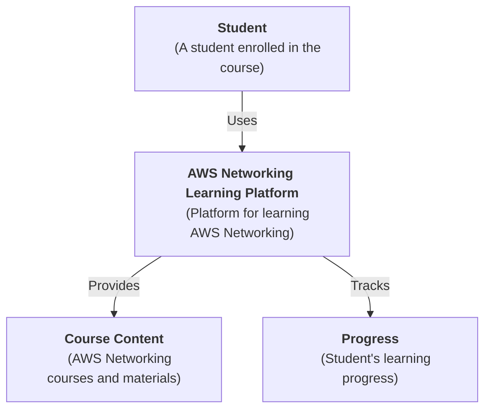
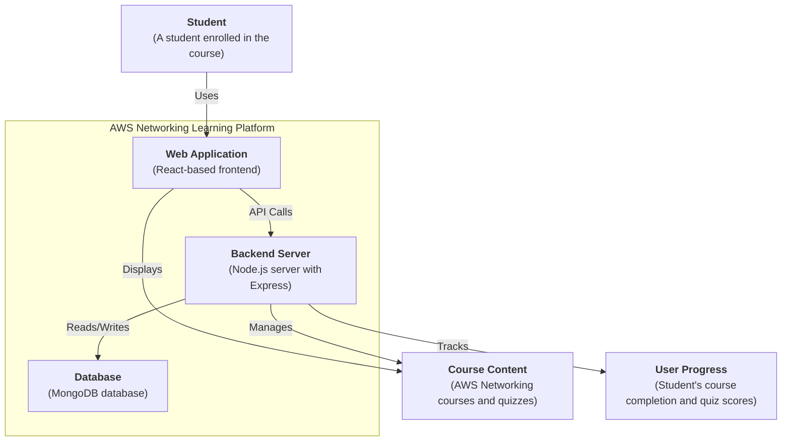
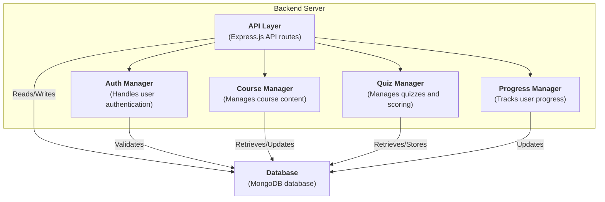

# AWS Networking Learning Platform - Architecture

## Context Diagram
This code shows the high-level interaction between the user (student) and the learning platform.

## Container Diagram
This diagram illustrates the main components of the learning platform.

## Component Diagram

This diagram shows the main components within the Backend Server.

