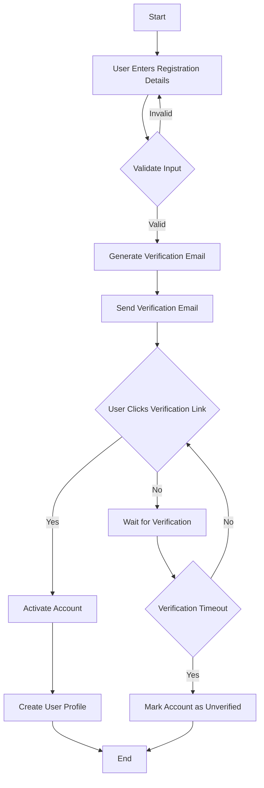
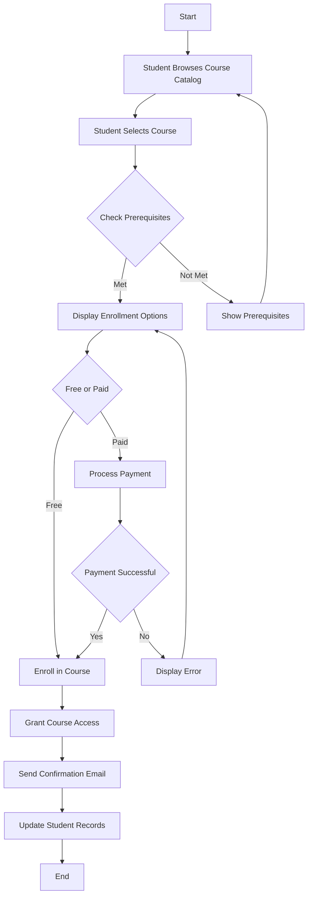
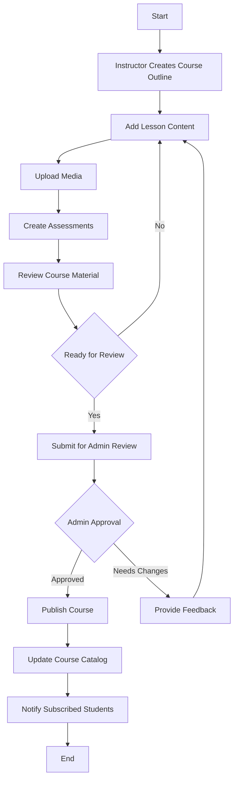
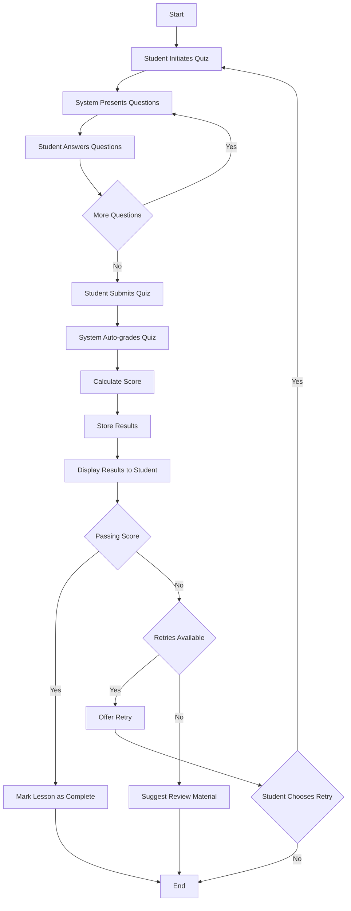
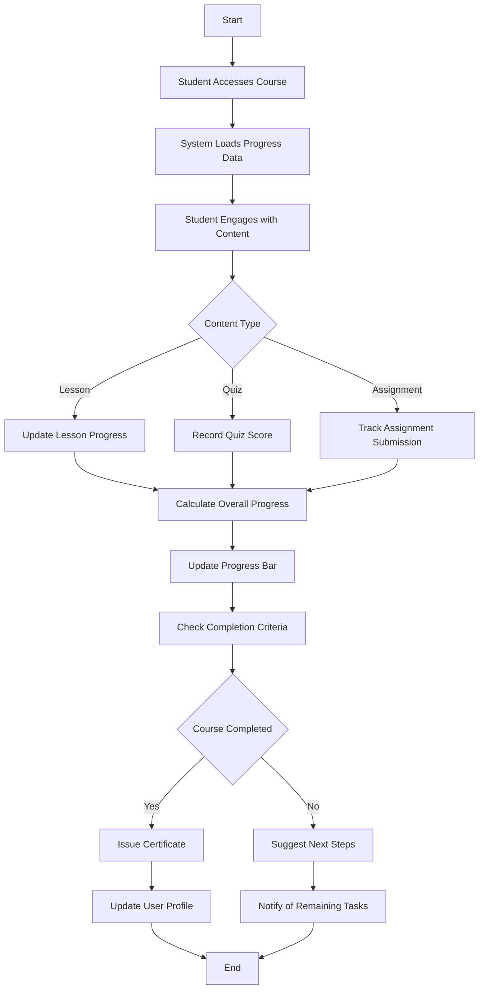
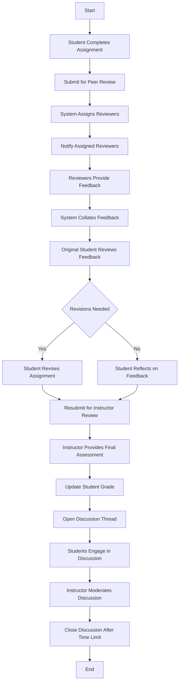

## User Registration Workflow ##

## Course Enrollment Workflow ##

   ## Content Creation and Publishing Workflow ##

## Quiz Taking and Grading Workflow ##

## Course Progress Tracking Workflow ##

## Content Update and Version Control Workflow ##

##  Peer Review and Discussion Workflow  ##

