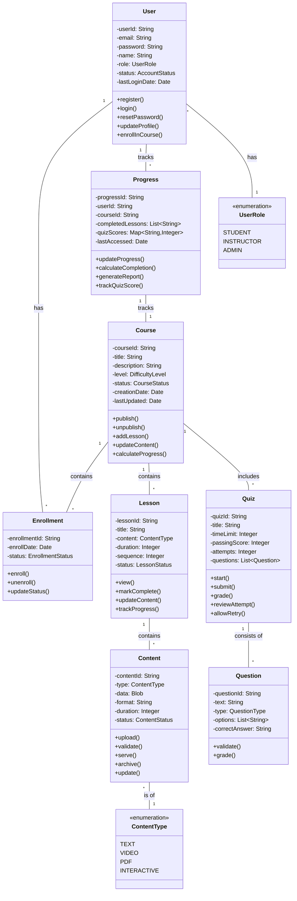

## Design Decisions Explanation:

This class diagram represents a structure of AWS Networking Services Learning Platform, showing all major classes and their relationships. It supports the functional requirements and use cases from previous assignments while maintaining clean object-oriented design principles.

    Class Structure:
        User class is central, connecting to Enrollment and Progress
        Course class manages educational content through Lessons and Quizzes
        Content class is separate from Lesson to allow reusability
        Progress class tracks both course and quiz completion

    Relationships:
        User-Course: Many-to-many through Enrollment class
        Course-Lesson: One-to-many composition
        Lesson-Content: One-to-many aggregation
        Quiz-Question: One-to-many composition

    Multiplicity:
        Users can enroll in multiple courses (1 to *)
        Courses can have multiple lessons (1 to *)
        Quizzes can have multiple questions (1 to *)

    Design Patterns:
        Composition used for course structure
        Aggregation for content management
        Separation of concerns between content and presentation

