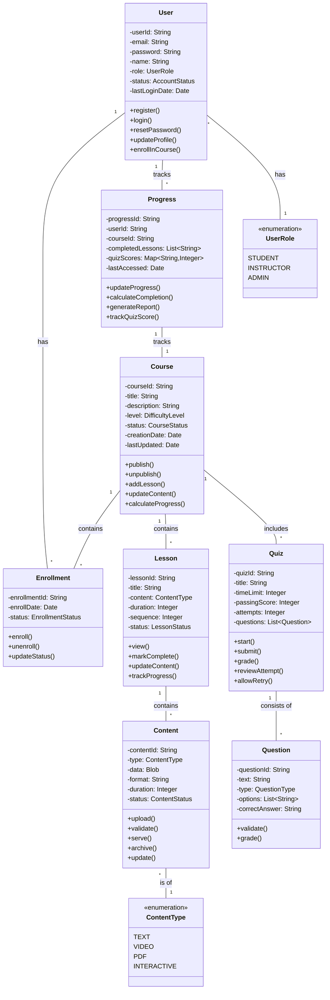

```mermaid
classDiagram
    class User {
        -userId: String
        -email: String
        -password: String
        -name: String
        -role: UserRole
        -status: AccountStatus
        -lastLoginDate: Date
        +register()
        +login()
        +resetPassword()
        +updateProfile()
        +enrollInCourse()
    }

    class Course {
        -courseId: String
        -title: String
        -description: String
        -level: DifficultyLevel
        -status: CourseStatus
        -creationDate: Date
        -lastUpdated: Date
        +publish()
        +unpublish()
        +addLesson()
        +updateContent()
        +calculateProgress()
    }

    class Lesson {
        -lessonId: String
        -title: String
        -content: ContentType
        -duration: Integer
        -sequence: Integer
        -status: LessonStatus
        +view()
        +markComplete()
        +updateContent()
        +trackProgress()
    }

    class Quiz {
        -quizId: String
        -title: String
        -timeLimit: Integer
        -passingScore: Integer
        -attempts: Integer
        -questions: List~Question~
        +start()
        +submit()
        +grade()
        +reviewAttempt()
        +allowRetry()
    }

    class Progress {
        -progressId: String
        -userId: String
        -courseId: String
        -completedLessons: List~String~
        -quizScores: Map~String,Integer~
        -lastAccessed: Date
        +updateProgress()
        +calculateCompletion()
        +generateReport()
        +trackQuizScore()
    }

    class Content {
        -contentId: String
        -type: ContentType
        -data: Blob
        -format: String
        -duration: Integer
        -status: ContentStatus
        +upload()
        +validate()
        +serve()
        +archive()
        +update()
    }

    class Enrollment {
        -enrollmentId: String
        -enrollDate: Date
        -status: EnrollmentStatus
        +enroll()
        +unenroll()
        +updateStatus()
    }

    class Question {
        -questionId: String
        -text: String
        -type: QuestionType
        -options: List~String~
        -correctAnswer: String
        +validate()
        +grade()
    }

    %% Enums
    class UserRole {
        <<enumeration>>
        STUDENT
        INSTRUCTOR
        ADMIN
    }

    class ContentType {
        <<enumeration>>
        TEXT
        VIDEO
        PDF
        INTERACTIVE
    }

    %% Relationships
    User "1" -- "*" Enrollment : has
    User "1" -- "*" Progress : tracks
    Course "1" -- "*" Enrollment : contains
    Course "1" -- "*" Lesson : contains
    Course "1" -- "*" Quiz : includes
    Lesson "1" -- "*" Content : contains
    Quiz "1" -- "*" Question : consists of
    User "*" -- "1" UserRole : has
    Content "*" -- "1" ContentType : is of
    Progress "1" -- "1" Course : tracks
```
