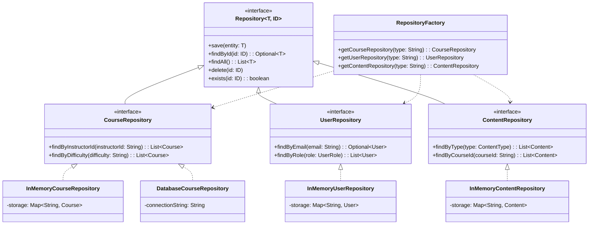

# Repository Structure Class Diagram

```mermaid
classDiagram
    class Repository~T, ID~ {
        <<interface>>
        +save(entity: T)
        +findById(id: ID): Optional~T~
        +findAll(): List~T~
        +delete(id: ID)
        +exists(id: ID): boolean
    }

    class CourseRepository {
        <<interface>>
        +findByInstructorId(instructorId: String): List~Course~
        +findByDifficulty(difficulty: String): List~Course~
    }

    class UserRepository {
        <<interface>>
        +findByEmail(email: String): Optional~User~
        +findByRole(role: UserRole): List~User~
    }

    class ContentRepository {
        <<interface>>
        +findByType(type: ContentType): List~Content~
        +findByCourseId(courseId: String): List~Content~
    }

    class InMemoryCourseRepository {
        -storage: Map~String, Course~
    }

    class InMemoryUserRepository {
        -storage: Map~String, User~
    }

    class InMemoryContentRepository {
        -storage: Map~String, Content~
    }

    class DatabaseCourseRepository {
        -connectionString: String
    }

    class RepositoryFactory {
        +getCourseRepository(type: String): CourseRepository
        +getUserRepository(type: String): UserRepository
        +getContentRepository(type: String): ContentRepository
    }

    Repository <|-- CourseRepository
    Repository <|-- UserRepository
    Repository <|-- ContentRepository
    
    CourseRepository <|.. InMemoryCourseRepository
    CourseRepository <|.. DatabaseCourseRepository
    UserRepository <|.. InMemoryUserRepository
    ContentRepository <|.. InMemoryContentRepository
    
    RepositoryFactory ..> CourseRepository
    RepositoryFactory ..> UserRepository
    RepositoryFactory ..> ContentRepository
```
