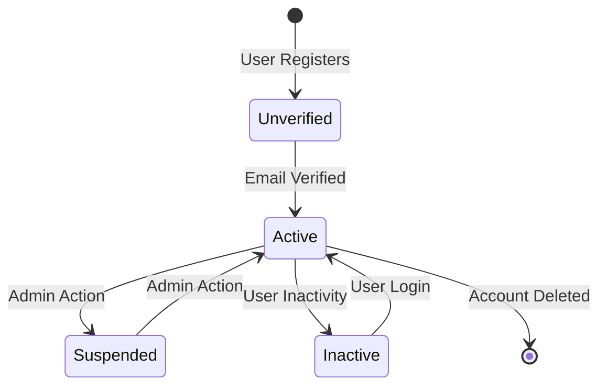

##  Object State Modeling with State Transition Diagrams ##

# User Account #

# Course #

stateDiagram-v2
    [*] --> Draft: Instructor Creates Course
    Draft --> UnderReview: Submitted for Review
    UnderReview --> Published: Approved
    UnderReview --> Draft: Revisions Needed
    Published --> Archived: Course Outdated
    Archived --> Draft: Update Initiated
    Published --> [*]: Course Deleted

# Enrollment #

stateDiagram-v2
    [*] --> Pending: Student Enrolls
    Pending --> Active: Payment Confirmed
    Pending --> Canceled: Enrollment Timeout
    Active --> Completed: Course Finished
    Active --> Dropped: Student Withdraws
    Completed --> [*]
    Dropped --> [*]

# Lesson #

stateDiagram-v2
    [*] --> InPreparation: Lesson Created
    InPreparation --> ReadyForReview: Content Added
    ReadyForReview --> Published: Approved
    ReadyForReview --> InPreparation: Revisions Needed
    Published --> Deprecated: Content Outdated
    Deprecated --> InPreparation: Update Initiated
    Published --> [*]: Lesson Removed

# Quiz #

stateDiagram-v2
    [*] --> Draft: Quiz Created
    Draft --> Active: Published
    Active --> InProgress: Student Starts Quiz
    InProgress --> Completed: Student Submits
    InProgress --> Abandoned: Time Limit Exceeded
    Completed --> Graded: Auto-Graded
    Graded --> [*]
    Abandoned --> [*]

# Certificate #

stateDiagram-v2
    [*] --> Pending: Course Completed
    Pending --> Generated: Certificate Created
    Generated --> Issued: Sent to Student
    Issued --> Verified: Employer Checks
    Verified --> Expired: Time Limit Reached
    Expired --> [*]

