```mermaid
graph TD
    Student((Student))
    Instructor((Instructor))
    Admin((Admin))
    AWS((AWS))
    System((System))

    Student --> |Registers| UC1[Register Account]
    Student --> |Logs in| UC2[Authenticate User]
    Student --> |Browses Courses| UC3[View Course Catalog]
    Student --> |Enrolls| UC4[Enroll in Course]
    Student --> |Accesses Content| UC5[Access Course Material]
    Student --> |Takes Quiz| UC6[Complete Assessment]
    Student --> |Tracks Progress| UC7[View Progress Dashboard]
    Student --> |Communicates| UC8[Participate in Discussion Forum]

    Instructor --> UC2
    Instructor --> |Creates Content| UC9[Manage Course Content]
    Instructor --> |Reviews| UC10[Review Student Progress]

    Admin --> UC2
    Admin --> |Manages Users| UC11[Manage User Accounts]
    Admin --> |Monitors| UC12[Monitor System Performance]

    AWS --> |Updates| UC13[Update AWS Service Information]

    System --> |Generates| UC14[Generate Completion Certificate]
    System --> |Sends| UC15[Send Notifications]
```

## Key actors and their roles:

    Student: Primary user of the platform, engages with learning content and assessments.
    Instructor: Creates and manages course content, reviews student progress.
    Admin: Manages the platform, user accounts, and monitors system performance.
    AWS: Provides updates on AWS services to keep content current.
    System: Automated actor that performs background tasks.

    Relationships between actors and use cases:

    All human actors (Student, Instructor, Admin) interact with the "Authenticate User" use case, representing a common entry point to the system.
    Students have the most interactions, covering core functionalities like course enrollment, content access, and progress tracking.
    Instructors focus on content management and student progress review.
    Admins handle user management and system monitoring.
    AWS has a specific interaction to update service information.
    The System actor performs automated tasks like certificate generation and notification sending.

    How the diagram addresses stakeholder concerns from Assignment 4:

    Students: The diagram includes use cases for course browsing, enrollment, content access, assessment completion, and progress tracking, addressing their key concerns about quality content, ease of use, and progress monitoring.
    Instructors: Use cases for managing course content and reviewing student progress address their needs for content creation tools and student engagement tracking.
    Admins: Use cases for user account management and system performance monitoring align with their concerns about system management and security.
    AWS: The inclusion of a use case for updating AWS service information addresses the concern about accurate 
